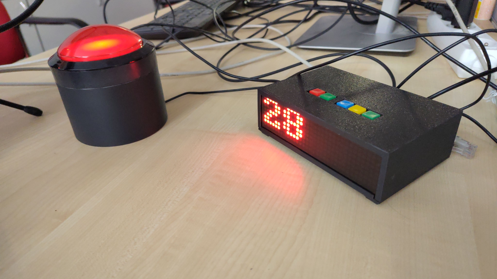

# LED panel

A small Raspberry Pi toy. It shows the time on an LED matrix, blinks an LED
and reacts to six buttons.

A [short video](https://youtu.be/8XoVibW1V2M) shows it running.

## Hardware

- MAX7219 LED matrix, 4 blocks, on SPI port 0
- LED on board pin 22 (GPIO25)
- Buttons on board pins 3, 5, 11, 13, 15 and 18, wired to 3V3

Pin numbers are BOARD numbers, not BCM.

## Run

    ./panel.py

Needs `luma.led_matrix` and `rpi-lgpio`, the maintained stand-in for
`RPi.GPIO`. Stop it with Ctrl-C.

To make the Pi start it on its own, see `setup/README.md`.

## Buttons

| Pin | What it does                |
|-----|-----------------------------|
| 3   | turns blinking on and off   |
| 5   | switches time and counter   |
| 18  | adds one to the counter     |
| 11, 13, 15 | scroll their pin name |

The counter is kept in `counter.txt` next to the script, so it survives a
restart.

## Files

`panel.py` is the program. `examples/` holds the older demos it was built
from. They still run on their own. `hardware/` holds the wiring, the case and
the datasheets, see `hardware/README.md`.

## Licensing and attribution

The code in this repository is licensed under the [GNU General Public License,
version 3 or later](LICENSE). The SPDX identifier is `GPL-3.0-or-later`.

Original project documentation, photographs, drawings, and other non-code
artifacts are intended to be distributed under [Creative Commons
Attribution-ShareAlike 4.0 International (CC BY-SA 4.0)](https://creativecommons.org/licenses/by-sa/4.0/).
See [LICENSES.md](LICENSES.md) for the scope of that recommendation.

Third-party assets retain their original licensing and attribution. In
particular, the Raspberry Pi 3 model in `hardware/parts/raspberry-pi-3/` is
based on the Thingiverse model by alexandre_willame:
https://www.thingiverse.com/thing:1701186

The manufacturer datasheets in `hardware/datasheets/` are included for
reference and should be treated as vendor-provided material. See
[ATTRIBUTIONS.md](ATTRIBUTIONS.md) for the original source references and
important reuse notes.
